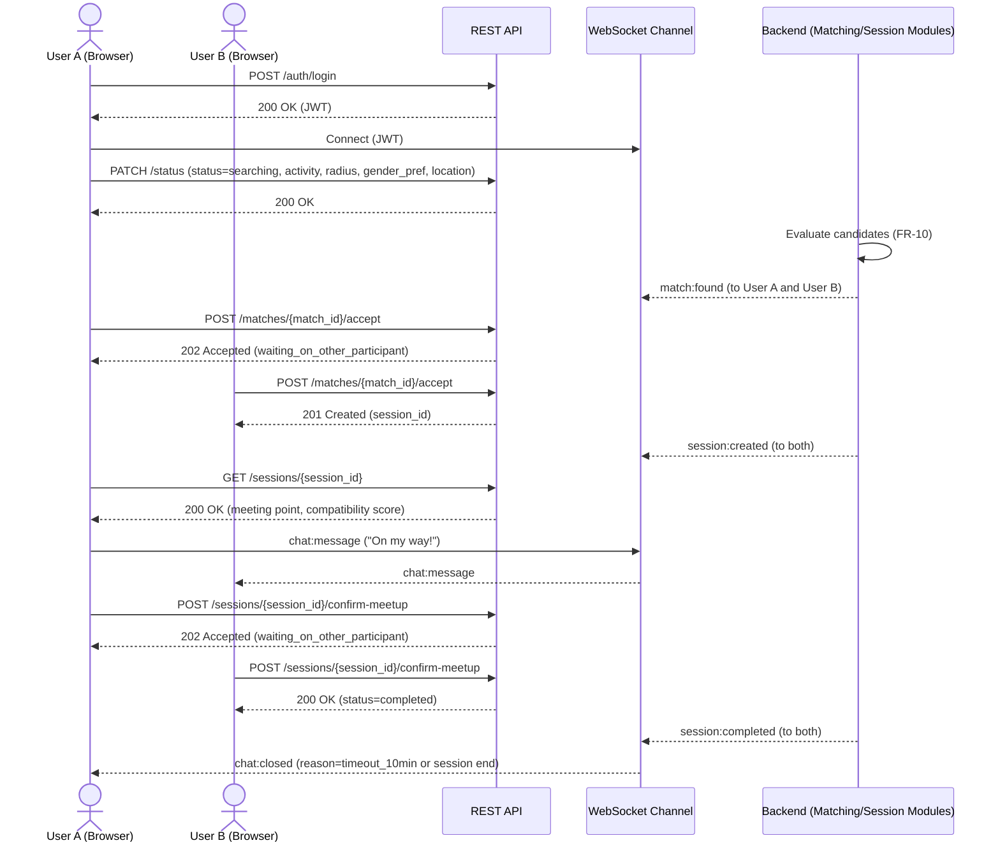
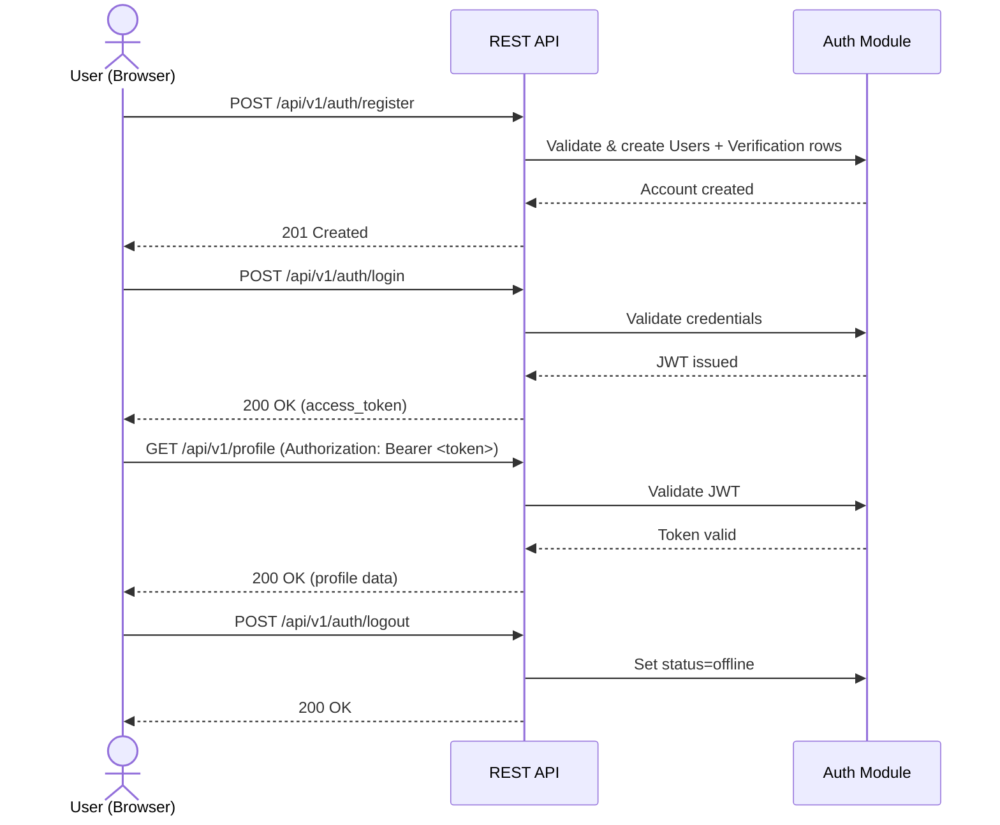
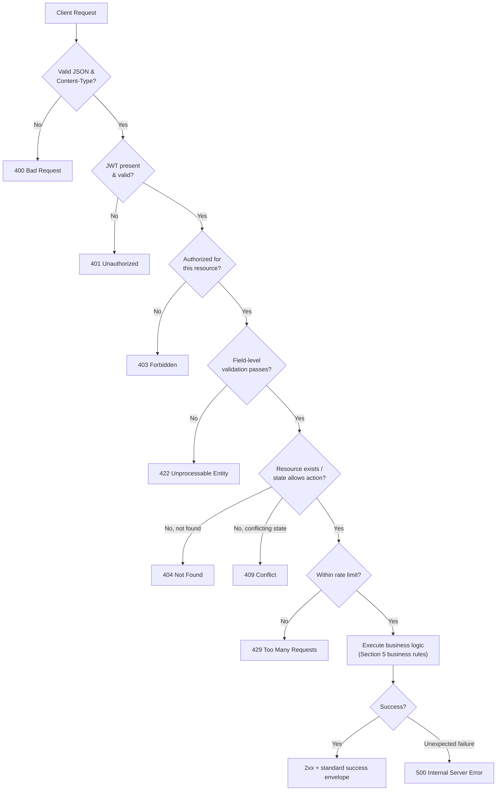

# PlayNow — API Specification

**Document Type:** API Specification (API.md)
**Source of Truth:** PRD v1.2 (Approved, Frozen) · Architecture.md v1.1 (Approved, Frozen) · Database.md v1.0 (Approved, Frozen)
**Audience:** Frontend Engineers (Next.js), Backend Engineers (FastAPI), QA
**Status:** Draft v1.0
**Scope Note:** This is a contract specification, not an implementation. It contains **no FastAPI code, no Python code, and no SQL** — only endpoint contracts, payload shapes (described, not as compiled code), and behavioral rules. Every endpoint and event maps to a specific PRD requirement (FR-XX/NFR-XX) and to entities already defined in Database.md. No product feature not already present in PRD v1.2 is introduced here.

---

## 1. API Philosophy

- **REST principles:** Resources (Users, Activities, Sessions, Matches, Verification, Messages, Reports) are addressed as nouns via URLs, and actions on them are expressed through HTTP methods (`GET`, `POST`, `PATCH`) rather than verbs in the URL, except where an action doesn't map cleanly to a CRUD verb (e.g., `POST /sessions/{id}/accept`) — a common, pragmatic REST convention for state-transition actions.
- **Stateless communication:** Every REST request carries its own authentication (a JWT, Section 3) and is processed without the server relying on server-side session/browser-cookie state between requests. The one exception is the WebSocket connection (Section 6), which is inherently long-lived and stateful for the duration of the connection, but even it is authenticated per-connection using the same JWT mechanism.
- **JSON request/response format:** All request and response bodies are JSON (`Content-Type: application/json`), with no other body format supported for the MVP.
- **Versioning strategy:** All REST endpoints are prefixed with a version segment (`/api/v1/...`, Section 2); the WebSocket endpoint is versioned identically.
- **Naming conventions:** Resource paths use lowercase, plural, hyphenated nouns (Section 16); JSON field names use `snake_case` to match the FastAPI/Python backend's natural conventions and the Database.md column naming, keeping the contract consistent end-to-end.
- **Consistent response format:** Every response — success or failure — follows the single envelope structure defined in Section 8, so frontend code can handle responses uniformly rather than special-casing each endpoint.

---

## 2. Base URL

All versioned REST endpoints are served under:

```
https://api.playnow.app/api/v1/
```

*(The domain above is illustrative — the actual production domain is a deployment detail owned by Architecture.md Section 15, not this document.)*

The WebSocket endpoint is served under the equivalent versioned path:

```
wss://api.playnow.app/api/v1/ws
```

One unversioned endpoint exists outside this prefix, by common convention:

```
GET /health
```

**Why versioning matters:** PlayNow's PRD is already on its third revision (v1.0 → v1.2) and this API is expected to evolve alongside future PRD versions (Group Sessions, Scheduling, and other Future Enhancements — Section 15). Prefixing every route with `/v1/` lets the backend introduce a `/v2/` in the future — for a breaking change — while existing frontend clients (including, eventually, a native mobile app per Architecture.md Section 20) continue to function unmodified against `/v1/` until they are explicitly migrated. See Section 14 for the full versioning strategy.

---

## 3. Authentication

Authentication follows the flow defined in Architecture.md Section 9, expressed here as an API contract.

- **Registration:** `POST /api/v1/auth/register` creates a `Users` row (Database.md 4.1) and a `Verification` row with Level 1 pending (FR-01, FR-21.1).
- **Login:** `POST /api/v1/auth/login` validates credentials and issues a signed **JWT** (FR-02, NFR-04).
- **JWT:** A signed, self-contained token carrying the user's `public_id` and an expiry claim. It is not stored server-side (Architecture.md Section 14) — validity is determined entirely by signature and expiry at request time.
- **Token expiration:** JWTs are short-lived (on the order of hours, not days) to limit the impact of a leaked token; the exact duration is a backend configuration value, not part of this contract.
- **Refresh strategy (future):** The MVP does not implement a refresh-token flow — when a JWT expires, the client must prompt the user to log in again. A refresh-token endpoint (`POST /api/v1/auth/refresh`) is a natural, additive Future Enhancement (Section 15) and is explicitly **not** part of this version.
- **Protected routes:** Every endpoint in this document except those explicitly marked "Not Required" in Section 5 requires a valid JWT, sent as a Bearer token in the `Authorization` header (`Authorization: Bearer <token>`).
- **Public routes:** `POST /api/v1/auth/register`, `POST /api/v1/auth/login`, and `GET /health` are the only endpoints that do not require authentication.
- **Logout:** `POST /api/v1/auth/logout` sets the user's `UserStatus.status` to `Offline` (FR-14.2) server-side. Because JWTs are stateless, the client is also responsible for discarding its locally stored token; the server does not maintain a token blacklist for the MVP (Architecture.md Section 14).

---

## 4. API Resources

| Resource | Purpose |
|---|---|
| **Auth** | Registration, login, logout — identity and JWT issuance (FR-01, FR-02, FR-14). |
| **Profile** | The authenticated user's own durable profile: display name, gender, Theme Preference (FR-03, FR-04, FR-15). |
| **Verification** | The authenticated user's tiered Verification Level and the initiation/confirmation of optional Level 2/3 steps (FR-21). |
| **Activities** | The read-only Sports Catalog available for selection (FR-05). |
| **Status** | The authenticated user's current matching state: status, availability, selected activity, search radius, gender preference, and approximate location (FR-06, FR-07, FR-08, FR-09, FR-22). |
| **Matches** | The pre-Session candidate-match accept/decline flow (FR-10, FR-11, FR-23). |
| **Sessions** | The confirmed Session: details, meeting point, expiration, manual completion/cancellation (FR-11, FR-12, FR-18). |
| **Messages** | Read access to a Session's ephemeral chat backlog, primarily for reconnection scenarios (FR-16); real-time send/receive happens over WebSocket (Section 6). |
| **Reports** | Submitting a report against another user from within a Session's chat (FR-16.5, FR-17). |
| **Safety** | Read-only Safety Center content (FR-20). |
| **Health** | A simple liveness endpoint for uptime monitoring; not a PRD-defined product feature, but a standard operational necessity. |

*(Moderation itself — reviewing reports, applying suspensions/bans — is a backend/Moderation Module workflow, not a set of endpoints exposed to the Next.js frontend; its only user-visible surface is the Reports resource above and the account-status-related error responses in Section 9.)*

---

## 5. Endpoint Specifications

*Every request/response body below is shown as an illustrative JSON example, not a schema definition language and not code. Field names match Database.md column names in `snake_case` where a direct mapping exists.*

### 5.1 Authentication

#### `POST /api/v1/auth/register`

- **Purpose:** Create a new account (FR-01).
- **Authentication:** Not required.
- **Path Parameters:** None.
- **Query Parameters:** None.
- **Request Body:**
```json
{
  "email": "user@example.com",
  "password": "a-strong-password",
  "display_name": "Aditya",
  "date_of_birth": "2004-03-15",
  "gender": "male"
}
```
- **Validation Rules:** `email` must be a syntactically valid address; `password` must meet minimum length/strength rules (Section 7); `display_name` non-empty, reasonable max length; `date_of_birth` must indicate an age at or above the platform's minimum age; `gender` must be one of the enumerated values (Database.md 4.1).
- **Success Response:** `201 Created`
```json
{
  "success": true,
  "data": {
    "user_id": "3f2a9c1e-...-uuid",
    "email": "user@example.com",
    "email_verification_status": "pending"
  }
}
```
- **Error Responses:** `400` (malformed body), `409` (email already registered), `422` (validation failure — see Section 9).
- **Business Rules:** A `Users` row and a `Verification` row (Level 1 pending) are created together (FR-01.1, FR-21.1). Duplicate email is rejected (FR-01.3). No JWT is issued at registration — the client must call `/auth/login` afterward.

---

#### `POST /api/v1/auth/login`

- **Purpose:** Authenticate and obtain a JWT (FR-02).
- **Authentication:** Not required.
- **Request Body:**
```json
{
  "email": "user@example.com",
  "password": "a-strong-password"
}
```
- **Validation Rules:** Both fields required and non-empty.
- **Success Response:** `200 OK`
```json
{
  "success": true,
  "data": {
    "access_token": "eyJhbGciOi...",
    "token_type": "bearer",
    "expires_in": 3600,
    "user_id": "3f2a9c1e-...-uuid"
  }
}
```
- **Error Responses:** `401` (invalid credentials — see FR-02.2, generic message regardless of which field was wrong), `403` (account `Suspended` or `Banned`, Section 9), `422` (malformed body).
- **Business Rules:** On success, an `AuditLogs` event (`UserLogin`) is recorded (Architecture.md Section 4). The response never indicates whether the email or the password was the incorrect field (FR-02.2).

---

#### `POST /api/v1/auth/logout`

- **Purpose:** End the current session and set status to Offline (FR-14).
- **Authentication:** Required.
- **Request Body:** None.
- **Success Response:** `200 OK`
```json
{ "success": true, "data": { "status": "offline" } }
```
- **Error Responses:** `401` (missing/invalid/expired token).
- **Business Rules:** Sets `UserStatus.status = Offline` (FR-14.2). The client must discard its local JWT; the server does not blacklist it (Section 3).

---

### 5.2 Profile

#### `GET /api/v1/profile`

- **Purpose:** Retrieve the authenticated user's own profile, Reputation Metrics, and Verification Level (FR-03, FR-19, FR-21).
- **Authentication:** Required.
- **Success Response:** `200 OK`
```json
{
  "success": true,
  "data": {
    "user_id": "3f2a9c1e-...-uuid",
    "display_name": "Aditya",
    "gender": "male",
    "theme_preference": "system_default",
    "member_since": "2026-06-01T00:00:00Z",
    "verification_level": 1,
    "reputation": {
      "matches_completed": 12,
      "cancelled_matches": 1,
      "no_shows": 0
    }
  }
}
```
- **Error Responses:** `401`.
- **Business Rules:** Never returns `email`, `password_hash`, `date_of_birth`, or any `Verification` proof detail (mobile number hash, college domain) — see Section 11, Privacy Considerations.

---

#### `PATCH /api/v1/profile`

- **Purpose:** Update editable profile fields (FR-03.2, FR-04, FR-15).
- **Authentication:** Required.
- **Request Body** *(all fields optional; only supplied fields are updated)*:
```json
{
  "display_name": "Aditya R.",
  "gender": "male",
  "theme_preference": "dark"
}
```
- **Validation Rules:** `display_name` non-empty if supplied; `gender` and `theme_preference` must be one of their respective enumerated values (Database.md 4.1).
- **Success Response:** `200 OK` — returns the updated profile in the same shape as `GET /profile`.
- **Error Responses:** `401`, `422` (invalid enum value).
- **Business Rules:** `theme_preference` has no effect on, and no relationship to, `gender` (FR-04.3) — the two fields are validated and stored completely independently. `email` and `date_of_birth` are **not** editable via this endpoint (immutable post-registration for the MVP).

---

### 5.3 Verification

#### `GET /api/v1/verification`

- **Purpose:** Retrieve the authenticated user's current verification status (FR-21).
- **Authentication:** Required.
- **Success Response:** `200 OK`
```json
{
  "success": true,
  "data": {
    "verification_level": 1,
    "email_verified": true,
    "mobile_verified": false,
    "college_verified": false
  }
}
```
- **Error Responses:** `401`.

#### `POST /api/v1/verification/mobile/initiate`

- **Purpose:** Begin optional Level 2 (Mobile) verification (FR-21.1).
- **Authentication:** Required.
- **Request Body:**
```json
{ "mobile_number": "+91XXXXXXXXXX" }
```
- **Validation Rules:** `mobile_number` must be a syntactically valid phone number.
- **Success Response:** `202 Accepted`
```json
{ "success": true, "data": { "verification_status": "code_sent" } }
```
- **Error Responses:** `401`, `422` (invalid number format), `429` (too many verification attempts, Section 10).
- **Business Rules:** The raw `mobile_number` is used only to send a one-time code and is **not** persisted beyond this transient step (Database.md 4.2 — only `mobile_number_hash` is ever stored, and only after successful confirmation).

#### `POST /api/v1/verification/mobile/confirm`

- **Purpose:** Complete Level 2 verification.
- **Authentication:** Required.
- **Request Body:**
```json
{ "code": "482913" }
```
- **Validation Rules:** `code` required, matches expected format (e.g., 6 digits).
- **Success Response:** `200 OK`
```json
{ "success": true, "data": { "verification_level": 2, "mobile_verified": true } }
```
- **Error Responses:** `401`, `400` (incorrect/expired code), `422`.
- **Business Rules:** On success, `Verification.mobile_verified_at` and `mobile_number_hash` are set, and `verification_level` recomputed to `2` (Database.md 4.2). Never required for any matching feature (FR-21.2).

#### `POST /api/v1/verification/college/initiate`

- **Purpose:** Begin optional Level 3 (College/University) verification (FR-21.1).
- **Authentication:** Required.
- **Request Body:**
```json
{ "college_email": "student@university.edu" }
```
- **Validation Rules:** Must be a syntactically valid email; institutional-domain checks (if any) are an application-layer concern outside this contract's scope.
- **Success Response:** `202 Accepted` (same shape as mobile initiate).
- **Error Responses:** `401`, `422`, `429`.
- **Business Rules:** Only the email **domain** is retained after success (`college_domain`, Database.md 4.2) — the full address is used transiently to deliver the confirmation step and is not persisted.

#### `POST /api/v1/verification/college/confirm`

- **Purpose:** Complete Level 3 verification.
- **Authentication:** Required.
- **Request Body:**
```json
{ "code": "739215" }
```
- **Success Response:** `200 OK`
```json
{ "success": true, "data": { "verification_level": 3, "college_verified": true } }
```
- **Error Responses:** `401`, `400`, `422`.
- **Business Rules:** Same pattern as mobile confirmation; always optional (FR-21.2).

---

### 5.4 Activities

#### `GET /api/v1/activities`

- **Purpose:** List the Sports Catalog available for selection (FR-05).
- **Authentication:** Required.
- **Query Parameters:** `active_only` (boolean, default `true`) — filters to `Activities.is_active = true` (Database.md 4.4).
- **Success Response:** `200 OK`
```json
{
  "success": true,
  "data": [
    { "activity_id": 1, "name": "Football", "slug": "football", "icon_key": "football" },
    { "activity_id": 2, "name": "Badminton", "slug": "badminton", "icon_key": "badminton" }
  ]
}
```
- **Error Responses:** `401`.
- **Business Rules:** Returns the catalog as data, not a hardcoded list (NFR-12) — adding a sport requires no change to this endpoint's contract, only a new row.

---

### 5.5 Status (Availability / Searching)

#### `GET /api/v1/status`

- **Purpose:** Retrieve the authenticated user's current matching state (FR-09).
- **Authentication:** Required.
- **Success Response:** `200 OK`
```json
{
  "success": true,
  "data": {
    "status": "searching",
    "availability": "available_now",
    "activity_id": 1,
    "search_radius_km": 5,
    "gender_preference": "any"
  }
}
```
- **Error Responses:** `401`.
- **Business Rules:** Never returns `approx_latitude`/`approx_longitude` back to the requesting user's own client verbatim beyond what it already knows — this endpoint reflects the user's own submitted state, not a privacy concern for themselves, but exact coordinates are still never part of any *other* user's view (Section 11).

#### `PATCH /api/v1/status`

- **Purpose:** The single endpoint for "Become Available" / "Search" / "Go Offline" / "Go Busy" — updates status and, when transitioning to `searching`, the associated preferences (FR-06, FR-07, FR-08, FR-09, FR-22).
- **Authentication:** Required.
- **Request Body** *(fields required depend on target `status`, see Validation Rules)*:
```json
{
  "status": "searching",
  "availability": "available_now",
  "activity_id": 1,
  "search_radius_km": 5,
  "gender_preference": "any",
  "latitude": 23.2599,
  "longitude": 77.4126
}
```
- **Validation Rules:**
  - `status` required; one of `offline`, `searching`, `busy` (`matched` is never client-settable — it is a server-derived state, Section 9 Business Rules below).
  - When `status = searching`: `activity_id` (must reference an active `Activities` row), `search_radius_km` (must be one of the platform's predefined values), `gender_preference`, `latitude`, and `longitude` are all **required** (FR-09.6, FR-22.2).
  - When `status = offline` or `busy`: the location/preference fields are ignored if supplied, and any previously stored `approx_latitude`/`approx_longitude` are cleared server-side (FR-09.3).
  - `latitude`/`longitude` are reduced to approximate precision server-side before storage (Architecture.md Section 8) — the client may send full-precision device coordinates; precision reduction is the server's responsibility, not the client's.
- **Success Response:** `200 OK` — returns the updated status in the same shape as `GET /status`.
- **Error Responses:** `401`, `403` (`Verification.email_verified_at` is null — Level 1 required before Searching, FR-01/FR-21.1), `422` (missing required fields for the target status, or invalid `activity_id`/`search_radius_km`).
- **Business Rules:** Setting `status = offline` immediately cancels any pending, unconfirmed match search and, if the user was `Matched`, ends the associated Session's chat (FR-09.5) — see Section 5.7. A user cannot set their own `status` to `matched` directly; that transition happens only as a side effect of `POST /matches/{match_id}/accept` (Section 5.6).

---

### 5.6 Matches (Pre-Session Candidate Flow)

*A "match" here is the ephemeral, pre-acceptance candidate pairing proposed by the Matching Module (Architecture.md Section 6) — it does not yet correspond to a `Sessions` database row (Database.md 4.5). It is communicated to clients primarily via the `match:found` WebSocket event (Section 6.2); these REST endpoints act on that same candidate by its `match_id`.*

#### `POST /api/v1/matches/{match_id}/accept`

- **Purpose:** Accept a proposed candidate match (FR-11.1).
- **Authentication:** Required.
- **Path Parameters:** `match_id` (UUID) — the candidate match identifier received via the `match:found` WebSocket event.
- **Request Body:** None.
- **Success Response (this user's acceptance recorded, awaiting the other participant):** `202 Accepted`
```json
{ "success": true, "data": { "match_id": "b7e1...-uuid", "waiting_on_other_participant": true } }
```
- **Success Response (both participants have now accepted — a Session is created):** `201 Created`
```json
{
  "success": true,
  "data": {
    "session_id": "9c44...-uuid",
    "status": "active",
    "expires_at": "2026-07-16T10:30:00Z"
  }
}
```
- **Error Responses:** `401`, `404` (unknown or already-resolved `match_id`), `409` (the candidate match already expired, was declined, or was already accepted/rejected by this user).
- **Business Rules:** A `Sessions` row is only created once **both** participants have called this endpoint (FR-11.3) — see Database.md 4.5. Upon creation, both users' `UserStatus.status` becomes `matched`, the Session Expiration timer starts (FR-18.1), and the `session:created` WebSocket event is emitted to both participants (Section 6.2).

#### `POST /api/v1/matches/{match_id}/decline`

- **Purpose:** Decline a proposed candidate match (FR-11.2).
- **Authentication:** Required.
- **Path Parameters:** `match_id` (UUID).
- **Request Body:** None.
- **Success Response:** `200 OK`
```json
{ "success": true, "data": { "match_id": "b7e1...-uuid", "status": "discarded" } }
```
- **Error Responses:** `401`, `404`, `409` (already resolved).
- **Business Rules:** Discards the candidate match for both participants; both return to `searching` status if they have not changed status manually (FR-11.2). No `Sessions` row is ever created for a declined match.

---

### 5.7 Sessions

#### `GET /api/v1/sessions/{session_id}`

- **Purpose:** Retrieve full details of a confirmed Session (FR-11.3, FR-12, FR-18, FR-23).
- **Authentication:** Required. Caller must be one of the Session's participants (Section 13, Authorization).
- **Path Parameters:** `session_id` (UUID).
- **Success Response:** `200 OK`
```json
{
  "success": true,
  "data": {
    "session_id": "9c44...-uuid",
    "activity": { "activity_id": 1, "name": "Football" },
    "status": "active",
    "compatibility_score": 82,
    "meeting_point": {
      "name": "Community Sports Ground",
      "latitude": 23.2612,
      "longitude": 77.4140
    },
    "expires_at": "2026-07-16T10:30:00Z",
    "other_participant": {
      "display_name_hidden": true,
      "verification_level": 2,
      "reputation": { "matches_completed": 5, "cancelled_matches": 0, "no_shows": 0 },
      "approx_distance_km": 1.2
    }
  }
}
```
- **Error Responses:** `401`, `403` (caller is not a participant of this Session), `404`.
- **Business Rules:** `other_participant` never includes a real name, contact detail, exact location, or any personally identifying field (FR-16.2, FR-19.2, Section 11) — only Reputation Metrics, Verification Level, and approximate distance, consistent with Database.md 4.10's "no direct write path" guarantee applying equally to reads exposed here.

#### `POST /api/v1/sessions/{session_id}/confirm-meetup`

- **Purpose:** Indicate that the meetup has begun, per FR-18.2's requirement that both users signal this before the Session expires.
- **Authentication:** Required. Caller must be a participant.
- **Path Parameters:** `session_id` (UUID).
- **Request Body:** None.
- **Success Response (this user confirmed, awaiting the other):** `202 Accepted`
```json
{ "success": true, "data": { "session_id": "9c44...-uuid", "waiting_on_other_participant": true } }
```
- **Success Response (both confirmed — Session completes):** `200 OK`
```json
{ "success": true, "data": { "session_id": "9c44...-uuid", "status": "completed" } }
```
- **Error Responses:** `401`, `403` (not a participant), `404`, `409` (Session already `expired`/`cancelled`/`completed`).
- **Business Rules:** On both-participants confirmation, `Sessions.status = Completed` (Database.md 4.5), `ReputationMetrics.matches_completed` increments for both participants (Database.md 4.10), and the `session:completed` WebSocket event fires.

#### `POST /api/v1/sessions/{session_id}/cancel`

- **Purpose:** Manually cancel a confirmed Session before its timer expires (FR-18.4).
- **Authentication:** Required. Caller must be a participant.
- **Path Parameters:** `session_id` (UUID).
- **Request Body:** None.
- **Success Response:** `200 OK`
```json
{ "success": true, "data": { "session_id": "9c44...-uuid", "status": "cancelled" } }
```
- **Error Responses:** `401`, `403`, `404`, `409` (already in a terminal state).
- **Business Rules:** Sets `Sessions.status = Cancelled`, `ended_reason = CancelledByParticipant`, records `SessionParticipants.left_at` for the cancelling user, closes the associated chat (FR-16.3), increments `ReputationMetrics.cancelled_matches` for the cancelling participant, returns both users to `searching` if they remain online (FR-18.3), and emits `session:cancelled` over WebSocket. This same endpoint is what the frontend's "End Chat" control invokes — for the MVP, ending the chat and cancelling the Session are the same action (there is no way to close chat while leaving the Session active).

---

### 5.8 Messages (Chat Backlog)

#### `GET /api/v1/sessions/{session_id}/messages`

- **Purpose:** Fetch the current message backlog for an active Session's chat — primarily intended for reconnection after a dropped WebSocket connection (Architecture.md Section 13), not as the primary chat delivery mechanism (that is the WebSocket, Section 6).
- **Authentication:** Required. Caller must be a participant.
- **Path Parameters:** `session_id` (UUID).
- **Query Parameters:** `after` (message ID or timestamp, optional) — return only messages after this point, to avoid re-fetching the full backlog on every reconnect.
- **Success Response:** `200 OK`
```json
{
  "success": true,
  "data": [
    { "message_id": 501, "is_from_me": false, "body": "Hey, running a bit late!", "sent_at": "2026-07-16T10:12:00Z" },
    { "message_id": 502, "is_from_me": true, "body": "No worries, see you soon.", "sent_at": "2026-07-16T10:12:30Z" }
  ]
}
```
- **Error Responses:** `401`, `403` (not a participant), `404` (Session not found, or its chat has already closed and messages purged — Database.md Section 6).
- **Business Rules:** `is_from_me` is the **only** sender indicator ever returned — no `sender_user_id`, name, or other identifier is included (FR-16.2). Once a Session's chat has closed and its `Messages` rows are purged (Database.md Section 6), this endpoint returns `404` rather than an empty list, to distinguish "nothing here yet" from "this chat no longer exists."

---

### 5.9 Reports & Safety

#### `POST /api/v1/sessions/{session_id}/report`

- **Purpose:** Submit a report against the other participant in a Session (FR-16.5, FR-17).
- **Authentication:** Required. Caller must be a participant.
- **Path Parameters:** `session_id` (UUID).
- **Request Body:**
```json
{
  "category": "harassment",
  "message_id": 501
}
```
- **Validation Rules:** `category` must be one of the enumerated values (Database.md 4.8: Harassment, SexualHarassment, Grooming, HateSpeech, Threats, AbusiveLanguage, ContactInfoSharing, OffPlatformAttempt, Other). `message_id`, if supplied, must reference a message within this Session.
- **Success Response:** `201 Created`
```json
{ "success": true, "data": { "report_id": "d2f8...-uuid", "status": "pending" } }
```
- **Error Responses:** `401`, `403` (not a participant), `404`, `422` (invalid category), `429` (Section 10).
- **Business Rules:** Creates a `Reports` row with `reported_user_id` set to the other Session participant automatically — the reporting user never has to supply an identifier for the person being reported (FR-16.2 consistency: the reporter never sees the other participant's real identity, only their Session-scoped presence). If `message_id` is supplied, a minimal excerpt of that message is copied into `message_excerpt` (Database.md 4.8) before normal chat purging occurs.

#### `POST /api/v1/sessions/{session_id}/block`

- **Purpose:** Block the other participant and immediately end the current chat (FR-16.5, UC-09).
- **Authentication:** Required. Caller must be a participant.
- **Path Parameters:** `session_id` (UUID).
- **Request Body:** None.
- **Success Response:** `200 OK`
```json
{ "success": true, "data": { "blocked": true, "session_id": "9c44...-uuid" } }
```
- **Error Responses:** `401`, `403`, `404`.
- **Business Rules:** Internally invokes the same Session-cancellation behavior as Section 5.7's cancel endpoint, and additionally instructs the Matching Module to exclude the blocked user from this caller's future candidate pools.

#### `GET /api/v1/safety-center`

- **Purpose:** Retrieve Safety Center content (FR-20).
- **Authentication:** Required.
- **Success Response:** `200 OK`
```json
{
  "success": true,
  "data": {
    "guidance": [
      "Meet only in public places.",
      "Inform a trusted friend or family member before meeting.",
      "Never share passwords or financial information.",
      "Do not pressure others to share personal information.",
      "Report suspicious behavior immediately.",
      "Respect all participants."
    ]
  }
}
```
- **Error Responses:** `401`.
- **Business Rules:** Content is static/configurable server-side data (Database.md 4, "Safety"), not user-specific — every user sees the same guidance (FR-20.3).

---

### 5.10 Health

#### `GET /health`

- **Purpose:** Liveness/uptime check for monitoring (operational necessity, not a PRD feature).
- **Authentication:** Not required.
- **Success Response:** `200 OK`
```json
{ "success": true, "data": { "status": "ok" } }
```
- **Error Responses:** None expected in normal operation (a non-2xx or connection failure itself is the signal).
- **Business Rules:** Performs no database queries beyond, at most, a trivial connectivity check; must remain extremely fast and dependency-light.

---

## 6. WebSocket Specification

### 6.1 Connection Lifecycle

- **Endpoint:** `wss://api.playnow.app/api/v1/ws`
- **Authentication:** The client supplies its JWT as a query parameter at connection time (e.g., `?token=<JWT>`), since browser WebSocket clients cannot set custom headers on the initial handshake. The server validates the JWT before completing the handshake and rejects the connection (closing with an appropriate WebSocket close code) if the token is missing, invalid, or expired. *(Security note: passing a JWT in a URL carries some inherent risk — e.g., it may be logged by intermediate proxies. This is mitigated by requiring TLS (`wss://`) for every connection and by the JWT's short expiry (Section 3); a future version could migrate to a first-message authentication handshake instead.)*
- **One connection per session:** Each authenticated user is expected to maintain a single active WebSocket connection; a new connection from the same user supersedes any prior one.
- **Disconnection behavior:** On disconnect (network loss, tab close, etc.), the server does **not** immediately change the user's `UserStatus.status` — the Session Expiration timer (server-side, authoritative, Architecture.md Section 13) is what ultimately resolves an abandoned Session, not the WebSocket connection state itself. On reconnect, the client should call `GET /api/v1/status` and, if applicable, `GET /api/v1/sessions/{session_id}` and `GET /api/v1/sessions/{session_id}/messages?after=...` to resynchronize state before resuming live updates.

### 6.2 Server → Client Events

| Event | Payload (illustrative) | Purpose |
|---|---|---|
| `match:found` | `{ "match_id": "...", "activity": {...}, "compatibility_score": 82, "approx_distance_km": 1.2 }` | A compatible candidate was found (FR-10.4, FR-23.1). |
| `match:discarded` | `{ "match_id": "...", "reason": "declined" \| "timeout" }` | The candidate match was declined or timed out (FR-11.2). |
| `session:created` | `{ "session_id": "...", "expires_at": "..." }` | Both participants accepted; a Session now exists (FR-11.3). |
| `session:updated` | `{ "session_id": "...", "waiting_on_other_participant": true }` | The other participant took an action (e.g., confirmed the meetup) that this client should reflect. |
| `session:expired` | `{ "session_id": "..." }` | The Session's timer reached zero without both confirmations (FR-18.2, FR-18.3). |
| `session:cancelled` | `{ "session_id": "..." }` | Either participant cancelled (FR-18.4) or blocked (FR-16.5). |
| `session:completed` | `{ "session_id": "..." }` | Both participants confirmed the meetup began (FR-18, Section 5.7). |
| `chat:message` | `{ "message_id": 502, "is_from_me": false, "body": "...", "sent_at": "..." }` | A new chat message (FR-16.1). Never includes sender identity beyond `is_from_me` (FR-16.2). |
| `chat:typing` *(optional)* | `{ "is_typing": true }` | Typing indicator; purely cosmetic, no persistence (not in Database.md — ephemeral signal only). |
| `chat:closed` | `{ "reason": "expired" \| "cancelled" \| "left" \| "timeout_10min" }` | The chat has ended (FR-16.3). |
| `error` | `{ "code": "...", "message": "..." }` | A server-side error relevant to the live connection (e.g., an internal failure while processing a chat message). |

### 6.3 Client → Server Events

| Event | Payload (illustrative) | Purpose |
|---|---|---|
| `chat:message` | `{ "session_id": "...", "body": "..." }` | Send a chat message within an active Session (FR-16.1). |
| `chat:typing` *(optional)* | `{ "session_id": "...", "is_typing": true }` | Notify the other participant of typing activity. |
| `ping` | *(empty)* | Heartbeat to keep the connection alive and detect silent disconnects. |

*Status changes, match accept/decline, and Session actions (cancel, confirm-meetup, report, block) are deliberately **REST-only** (Section 5), not WebSocket client events — this keeps state-changing actions on the more easily validated, retriable, and cacheable REST surface, while the WebSocket is reserved for what it's actually needed for: low-latency push and the chat message stream itself.*

### 6.4 Server Response to Client Events

- A `chat:message` sent by a client is only accepted if: (a) the sender is validated as an active participant of the referenced `session_id`, (b) the Session's `status = Active`, and (c) the message body passes the length/content validation in Section 7. On success, the message is broadcast to the other participant as `chat:message`; on failure, an `error` event is returned to the sender only.

---

## 7. Request Validation

| Field | Rule |
|---|---|
| **Email** | Must match standard email syntax; case-insensitive uniqueness enforced at the database level (Database.md 4.1). |
| **Password** | Minimum length (e.g., 8+ characters) and at least one number or special character, per PRD FR-01.2; never echoed back in any response. |
| **Activity IDs** | Must be a positive integer referencing an existing `Activities` row with `is_active = true` (Database.md 4.4). |
| **Session IDs** | Must be a well-formed UUID matching `Sessions.public_id`; the caller must additionally be a participant (Section 13). |
| **UUIDs (general)** | All public-facing identifiers (`user_id`, `session_id`, `match_id`, `report_id`) are UUIDs, never internal auto-increment integers (Database.md Section 1). |
| **Search Radius** | Must be one of the platform's predefined values (FR-07.1); arbitrary integers are rejected. |
| **Availability** | Must be exactly `available_now` for the MVP (FR-22.1) — any other value is rejected with `422`, reserving the enum for future expansion without a breaking API change. |
| **Message Length** | Non-empty, and capped at a reasonable maximum (e.g., 1,000 characters) to bound storage and moderation review size (Database.md 4.7). |
| **Gender / Gender Preference** | Must be one of the enumerated values (Database.md 4.1/4.3). |
| **Theme Preference** | Must be one of `dark`, `light`, `system_default` (FR-15.1). |
| **Report Category** | Must be one of the enumerated values in Database.md 4.8. |
| **Coordinates** | `latitude`/`longitude`, if supplied, must be within valid geographic bounds (-90..90, -180..180); precision reduction happens server-side regardless of client-supplied precision (Section 5.5). |

---

## 8. Standard Response Format

Every response uses the same top-level envelope.

**Success:**
```json
{
  "success": true,
  "data": { }
}
```

**Error (generic shape):**
```json
{
  "success": false,
  "error": {
    "code": "RESOURCE_NOT_FOUND",
    "message": "The requested session could not be found.",
    "details": []
  }
}
```

**Validation Failure:**
```json
{
  "success": false,
  "error": {
    "code": "VALIDATION_ERROR",
    "message": "One or more fields failed validation.",
    "details": [
      { "field": "email", "issue": "must be a valid email address" },
      { "field": "password", "issue": "must be at least 8 characters" }
    ]
  }
}
```

**Authentication Failure:**
```json
{
  "success": false,
  "error": {
    "code": "AUTH_INVALID_CREDENTIALS",
    "message": "Invalid email or password.",
    "details": []
  }
}
```

**Resource Not Found:**
```json
{
  "success": false,
  "error": {
    "code": "RESOURCE_NOT_FOUND",
    "message": "The requested resource could not be found.",
    "details": []
  }
}
```

**Rate Limited:**
```json
{
  "success": false,
  "error": {
    "code": "RATE_LIMITED",
    "message": "Too many requests. Please try again later.",
    "details": [ { "retry_after_seconds": 30 } ]
  }
}
```

**Server Error:**
```json
{
  "success": false,
  "error": {
    "code": "INTERNAL_SERVER_ERROR",
    "message": "Something went wrong on our end. Please try again.",
    "details": []
  }
}
```

---

## 9. Error Catalogue

| HTTP Status | Used When | Example `error.code` |
|---|---|---|
| **400 Bad Request** | The request is malformed at a structural level (e.g., invalid JSON, wrong content type) — distinct from field-level validation failures. | `MALFORMED_REQUEST` |
| **401 Unauthorized** | No JWT supplied, or the JWT is invalid/expired; also used for `POST /auth/login` with incorrect credentials. | `AUTH_MISSING_TOKEN`, `AUTH_TOKEN_EXPIRED`, `AUTH_INVALID_CREDENTIALS` |
| **403 Forbidden** | The caller is authenticated but not authorized for this action — e.g., not a participant of the Session being accessed, or the account is `Suspended`/`Banned` (Database.md 4.1). | `NOT_A_PARTICIPANT`, `ACCOUNT_SUSPENDED`, `ACCOUNT_BANNED`, `VERIFICATION_LEVEL_1_REQUIRED` |
| **404 Not Found** | The referenced resource (`session_id`, `match_id`, `report_id`, etc.) does not exist, or exists but its ephemeral data has already been purged (e.g., a chat backlog after purge). | `RESOURCE_NOT_FOUND` |
| **409 Conflict** | The request is valid but conflicts with the resource's current state — e.g., accepting an already-declined match, cancelling an already-completed Session, registering a duplicate email. | `ALREADY_RESOLVED`, `INVALID_STATE_TRANSITION`, `EMAIL_ALREADY_REGISTERED` |
| **422 Unprocessable Entity** | The request is well-formed JSON but fails field-level validation (Section 7). | `VALIDATION_ERROR` |
| **429 Too Many Requests** | The caller has exceeded a rate limit (Section 10). | `RATE_LIMITED` |
| **500 Internal Server Error** | An unexpected server-side failure. Never exposes internal details (stack traces, query text) in the response body. | `INTERNAL_SERVER_ERROR` |

---

## 10. Rate Limiting Policy

| Action | Limit (illustrative) | Reasoning |
|---|---|---|
| **Login attempts** | e.g., 5 attempts per email per 15 minutes | Reduces brute-force credential-guessing risk (Architecture.md Section 12). |
| **Account creation** | e.g., a small number of registrations per IP per hour | Limits automated fake-account creation, complementing Level 1 email verification (FR-01.3, FR-21). |
| **Search requests (`PATCH /status`)** | e.g., a modest per-minute cap per user | Prevents a single client from hammering the Matching Module's search evaluation with rapid preference changes. |
| **Chat messages** | e.g., a modest per-minute cap per user per Session | Limits chat spam/flooding within the short-lived Anonymous Chat window (FR-16). |
| **Reports** | e.g., a modest per-day cap per user | Limits bad-faith report flooding against the Moderation Module's review queue (FR-17), while still allowing legitimate use. |
| **Verification code requests** | e.g., a small number of `initiate` calls per hour | Limits abuse of the SMS/email-sending mechanism behind Level 2/3 verification. |

All rate limits return `429 Too Many Requests` with the standard envelope (Section 8) and a `retry_after_seconds` hint. Exact numeric thresholds are a backend configuration concern, tunable post-launch based on real pilot traffic (PRD Section 19, Success Metrics) rather than fixed permanently by this document.

---

## 11. Privacy Considerations

The following are **never** returned by any endpoint in this specification, regardless of caller or context:

- `password_hash` (or any password-derived value) — Section 5.2, Database.md 4.1.
- The full `mobile_number` or full `college_email` used during verification — only the derived `mobile_verified`/`college_verified` booleans and the overall `verification_level` are ever exposed (Section 5.3, Database.md 4.2).
- Exact GPS coordinates of any user, to any other user, at any time — only `approx_distance_km` is exposed in a Session/match context (Section 5.7), and a user's own submitted coordinates are never echoed back with full precision even to themselves once stored (Section 5.5).
- Private contact details of any kind (real name beyond `display_name` where appropriate, phone number, email) of the *other* participant in a Session — `GET /sessions/{id}` explicitly withholds these (Section 5.7).
- Internal moderation data — a reporting user never sees another user's `ModerationActions` history, and a reported user is never shown the identity of their reporter.
- Internal numeric IDs (`Users.id`, `Sessions.id`, etc.) — every response uses the `public_id` (UUID) form; internal IDs never appear in any request or response body (Database.md Section 1, Section 16 below).
- Raw chat message sender identity beyond the caller-relative `is_from_me` flag (Section 5.8, 6.2).

---

## 12. Session Flow



---

## 13. API Security

- **JWT validation:** Every protected REST request and every WebSocket connection validates the JWT's signature and expiry before any business logic runs (Section 3).
- **Authorization:** Beyond authentication, every Session-scoped endpoint (`GET/POST /sessions/{id}/...`) independently verifies that the caller is one of that Session's `SessionParticipants` (Database.md 4.6) before returning any data — authentication alone is not sufficient authorization to view another user's Session.
- **Input validation:** All request bodies are validated server-side per Section 7, regardless of any client-side validation already performed by the Next.js frontend.
- **Rate limiting:** Applied per Section 10, primarily on authentication, account creation, chat, and reporting endpoints.
- **CORS:** The API only accepts cross-origin requests from the deployed Next.js frontend's known origin(s); no wildcard (`*`) CORS policy is used given the presence of authenticated, privacy-sensitive endpoints.
- **HTTPS:** All REST and WebSocket traffic is served exclusively over TLS (`https://`/`wss://`) — no plaintext endpoint exists (Architecture.md Section 12).
- **UUID usage:** All externally-referenced identifiers are UUIDs (Section 7, Section 16), which additionally makes resource IDs non-sequential and non-enumerable, reducing the risk of ID-guessing attacks against, e.g., `session_id`.
- **Request size limits:** Request bodies are capped at a reasonable maximum size (primarily relevant to `chat:message`/report submission, Section 7) to prevent trivial payload-flooding.
- **Replay protection considerations:** JWTs are short-lived (Section 3), which bounds the window during which a captured token could be replayed; the MVP does not implement additional nonce-based replay protection beyond TLS and token expiry, which is considered adequate for this MVP's threat model — a candidate for future hardening (Section 15) if the product scales beyond a pilot.

---

## 14. Versioning Strategy

- The `/api/v1/` prefix (Section 2) is the unit of versioning; all endpoints in this document belong to `v1`.
- **Non-breaking changes** (adding a new optional request field, adding a new response field, adding a new endpoint) may be introduced within `v1` without a version bump, provided existing clients continue to function unmodified — additive changes only.
- **Breaking changes** (removing/renaming a field, changing a field's type or meaning, changing required-ness, altering an endpoint's URL or method) require a new version prefix (`/api/v2/`), served **alongside** `/api/v1/` for a defined deprecation window, rather than replacing it outright — consistent with Architecture.md's principle of layering future capability on rather than redesigning.
- The WebSocket event catalogue (Section 6) follows the same philosophy: new event types are additive; changing the shape of an existing event is a breaking change requiring version coordination between frontend and backend releases.
- This strategy is what allows the Future Enhancements in Section 15 (e.g., Group Sessions, which would change the shape of `other_participant` into a list) to be introduced as `v2` behavior without breaking the MVP's existing `v1` contract for any client that hasn't migrated yet.

---

## 15. Future Endpoints

*The following are explicitly OUTSIDE MVP scope (PRD Section 6, Out of Scope; PRD Section 18, Future Enhancements) and are listed here only to show how this API is expected to evolve — none of these are implemented in v1.*

- **Group Sessions:** `GET /api/v2/sessions/{id}/participants` (plural), a Waiting Lobby status endpoint, and WebSocket events reflecting partial-lobby-fill state (e.g., "6/10 players").
- **Notifications:** `GET /api/v1/notifications`, `POST /api/v1/notifications/{id}/read`, and a `notification:new` WebSocket event, likely subscribing to the same event stream that already feeds `AuditLogs` (Database.md Section 19).
- **Events (Community Events):** `GET /api/v1/events`, `POST /api/v1/events/{id}/join`, mirroring the Sessions/SessionParticipants pattern.
- **Scheduling ("Available Later"):** An expanded `availability` enum on `PATCH /status` plus a new `GET/POST /api/v1/schedule` resource for advance-planned availability windows.
- **Leaderboards:** `GET /api/v1/leaderboards?activity_id=...`, derived from existing Reputation Metrics.
- **Teams:** `GET/POST /api/v1/teams`, `POST /api/v1/teams/{id}/members`.
- **Voice Chat:** An extension of the WebSocket channel (or a dedicated signaling endpoint) scoped to an active Session, following the same lifecycle as text chat (Section 6).
- **Weather:** A `weather` field added to `GET /sessions/{id}`'s meeting-point payload, sourced from a future Weather API integration (Architecture.md Section 11.4).
- **Password Reset:** `POST /api/v1/auth/password-reset/request`, `POST /api/v1/auth/password-reset/confirm` (Section 3).
- **Token Refresh:** `POST /api/v1/auth/refresh` (Section 3).

---

## 16. API Naming Standards

- **Plural resources:** Collection-style resources are plural nouns (`/activities`, `/sessions`, `/matches`); a specific resource is addressed by appending its identifier (`/sessions/{session_id}`).
- **HTTP methods:** `GET` for retrieval (no side effects), `POST` for creation or a non-idempotent state-changing action (`/accept`, `/decline`, `/cancel`, `/report`), `PATCH` for partial updates to an existing resource (`/profile`, `/status`). `PUT` and `DELETE` are not used in this version, since no resource in the MVP is fully replaced or hard-deleted via the API.
- **Status codes:** Used precisely per Section 9 — `2xx` for success (with `201`/`202` distinguishing "created" from "accepted, pending further action" where relevant, e.g., match acceptance), `4xx` for client-caused failures, `5xx` reserved strictly for genuine server-side failures.
- **JSON naming:** All field names use `snake_case`, matching Database.md's column naming exactly where a field maps directly to a column, to minimize translation friction between layers.
- **UUID usage:** Every externally-visible identifier is a UUID string, never an internal integer (Section 11, Section 13).
- **Timestamp format:** All timestamps are ISO 8601 in UTC with a trailing `Z` (e.g., `2026-07-16T10:30:00Z`), matching Database.md's UTC-only storage convention (Section 1) — no local-timezone timestamps are ever returned by the API; timezone conversion for display is a Frontend concern.

---

## 17. Assumptions

*API-level assumptions, distinct from the frozen PRD/Architecture/Database requirements.*

- Exact rate-limit thresholds (Section 10) and JWT expiry duration (Section 3) are left as tunable backend configuration rather than fixed numeric values in this contract, since the PRD does not specify exact numbers and real values should be set from pilot traffic data.
- The WebSocket authentication approach (JWT via query parameter, Section 6.1) is assumed acceptable for the MVP's threat model; a more robust first-message handshake is treated as a future hardening step, not a blocking MVP requirement.
- "End Chat" and "Cancel Session" are assumed to be the same underlying action for the MVP (Section 5.7) — the PRD does not describe a scenario where chat ends while the Session itself remains active, so no separate endpoint was introduced for this.
- A single WebSocket connection per user is assumed sufficient; the API does not attempt to support or reconcile multiple simultaneous connections (e.g., two open browser tabs) for the MVP.
- CORS origins, exact request-size limits, and other operational thresholds (Section 13) are deployment configuration, not part of this document's frozen contract.

---

## 18. Risks

| Risk | Impact | Mitigation |
|---|---|---|
| **Spam registrations or reports** | Medium — degrades data quality and Moderation Module workload | Rate limiting on `POST /auth/register` and `POST /sessions/{id}/report` (Section 10); Level 1 email verification as a baseline barrier (FR-01, FR-21). |
| **Rate abuse of chat or search endpoints** | Medium — could degrade realtime performance for other users | Per-user, per-endpoint rate limits (Section 10); WebSocket `chat:message` validated against the same limits as the REST surface. |
| **Session race conditions (both users acting simultaneously, e.g., both cancelling and confirming at once)** | Medium — could produce inconsistent state if not handled carefully | `Sessions.status` transitions are treated as atomic, single-writer-wins operations server-side; a `409 Conflict` (Section 9) is returned to whichever request loses the race, with the client expected to re-fetch current state via `GET /sessions/{id}`. |
| **Duplicate requests (e.g., a client retries `POST /matches/{id}/accept` after a slow response)** | Low–Medium — could be misinterpreted as a double action | Accept/decline/cancel/confirm-meetup endpoints are designed to be safely repeatable: calling them again on an already-resolved resource returns `409 Conflict` rather than performing the action twice, rather than silently succeeding with a duplicate side effect. |
| **Network failures mid-flow (e.g., WebSocket drops during an active Session)** | Medium — client could show stale state | Server-side Session timer remains authoritative regardless of connection state (Section 6.1); REST GET endpoints are always available to resynchronize state after reconnect. |
| **JWT-in-query-string exposure (Section 6.1)** | Low–Medium — could be logged by intermediate infrastructure | TLS-only connections, short token expiry, and treating this as a documented, accepted MVP tradeoff rather than an unrecognized gap (Section 17). |

---

## 19. Diagram Appendix

*The Session Flow sequence diagram appears in Section 12. The remaining required diagrams are provided below.*

### 19.1 Authentication Flow



### 19.2 WebSocket Lifecycle

```mermaid
sequenceDiagram
    actor U as User (Browser)
    participant WS as WebSocket Endpoint
    participant BE as Backend

    U->>WS: Connect (wss://.../ws?token=JWT)
    WS->>BE: Validate JWT
    alt Token valid
        BE-->>WS: Accept connection
        WS-->>U: Connection established
        loop While connected
            BE-->>WS: Server events (match:found, chat:message, session:*)
            WS-->>U: Forward event
            U->>WS: Client events (chat:message, ping)
            WS->>BE: Forward event
        end
        U--xWS: Disconnect (network loss / tab close)
        Note over BE: Session timer remains authoritative;<br/>no immediate status change on disconnect
    else Token invalid/expired
        BE-->>WS: Reject
        WS-->>U: Close connection (auth error)
    end
```

### 19.3 API Request Lifecycle



---

*End of Document*

