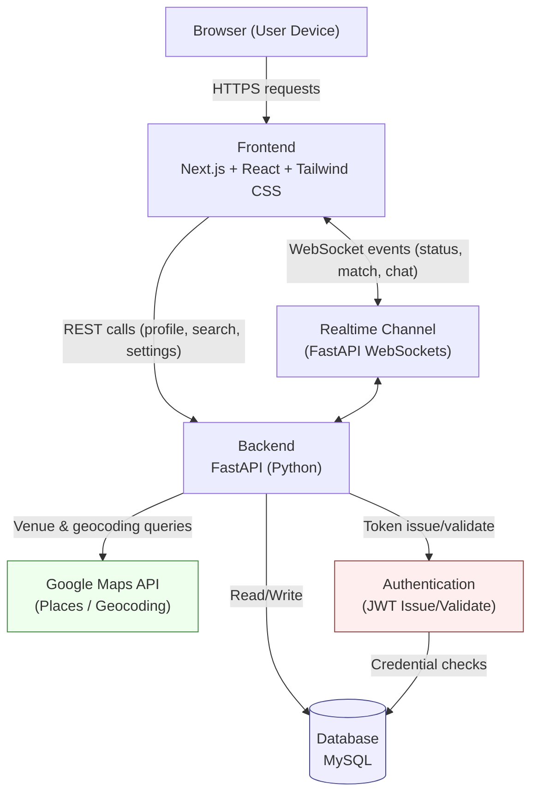
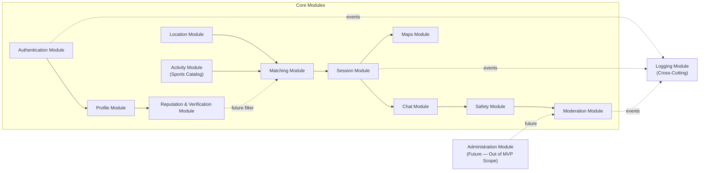
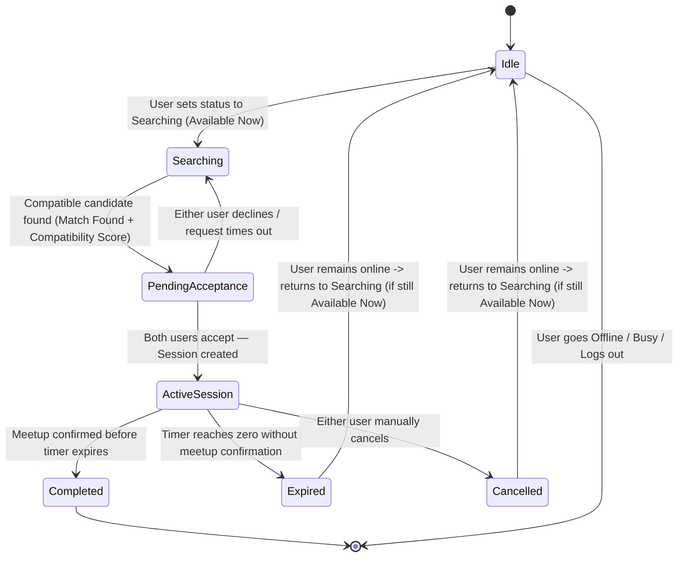
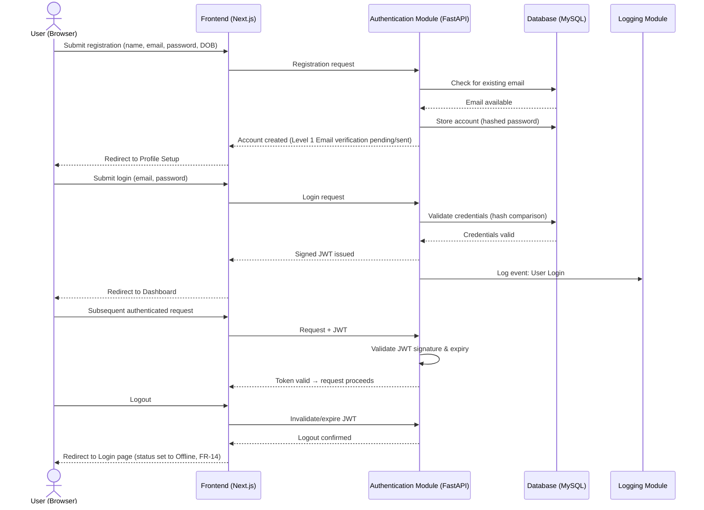
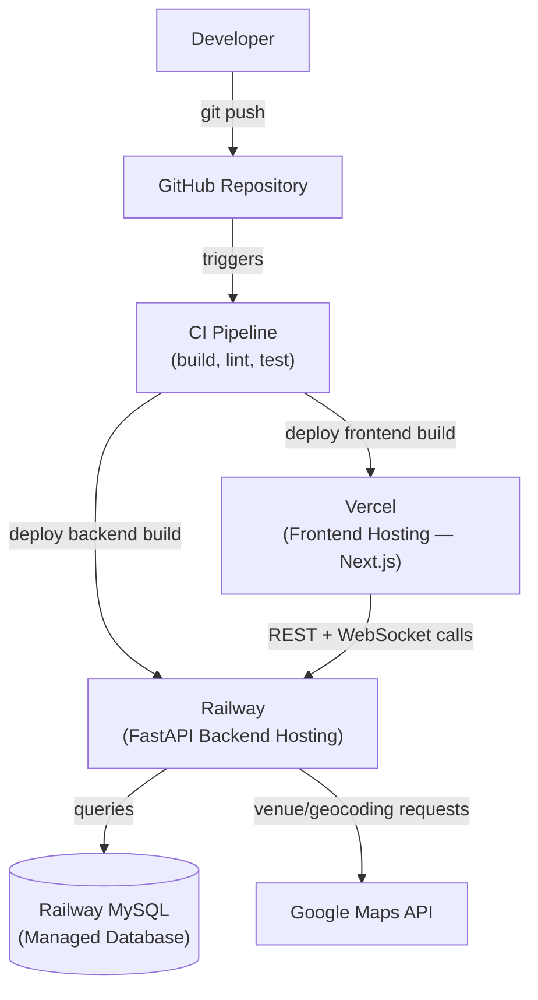

# PlayNow — System Architecture Document

**Document Type:** System Architecture Document (Architecture.md)
**Source of Truth:** Product Requirements Document — PlayNow PRD v1.2 (Approved, Frozen)
**Audience:** Backend Engineers, Frontend Engineers, QA, DevOps
**Status:** Draft v1.1 (Revised to reflect Approved Technology Stack, following Technical Leadership review)
**Scope Note:** This document describes architecture only. It does not modify, add to, or reinterpret the requirements in PRD v1.2. Every module and flow described below maps to a specific PRD requirement (referenced inline as FR-XX / NFR-XX) so that traceability is preserved. No database schemas, API contracts, UI designs, or implementation code are included here — those belong in Database.md, API.md, and design artifacts respectively.

> **Revision Note (v1.1):** Following technical leadership review, this document has been updated to reflect the team's approved technology stack — FastAPI (Python) on the backend, MySQL for the database, and FastAPI WebSockets for realtime communication — chosen to maximize maintainability given the team's strongest experience (Python, HTML, CSS, JavaScript) and to minimize dependence on unfamiliar tooling. A dedicated Moderation Module and a new Logging Module have also been introduced. No product requirements were changed.

---

## 1. Architecture Overview

PlayNow is a location-aware, responsive web application. At a high level, the system is a client-server application with a clear separation between presentation, business logic, and persistence, plus two external integrations (Maps and Authentication) that are treated as replaceable, abstracted dependencies rather than tightly coupled parts of the core system.

### 1.1 Frontend
The Frontend is a responsive single-page web client responsible for all user-facing interaction: registration/login forms, profile and settings (including Theme Preference and Verification), the sport/radius/gender preference selection screen, the Searching state, the Match Found screen (with Match Compatibility Score), the Anonymous Chat interface, the Map/meeting-point view, and the Safety Center. It communicates with the Backend exclusively through a defined API boundary and a realtime channel for chat and status updates. It holds no business logic beyond input validation and presentation state.

### 1.2 Backend
The Backend is the system's business-logic layer, implemented in **FastAPI (Python)**. It owns the Matching Engine, Session lifecycle management, Meeting Point Recommendation ranking, Match Compatibility Score calculation, Reputation Metrics bookkeeping, Verification Level tracking, and Safety enforcement (Report/Block), now organized to include a dedicated Moderation Module and a dedicated Logging Module (Section 4). It is the only component permitted to talk to the Database and to external integrations (Google Maps, the Authentication provider). The Backend is intentionally organized into cohesive modules (Section 4) so that each responsibility can evolve independently. FastAPI was selected because it is a Python framework, directly matching the team's strongest existing language experience, while also providing native asynchronous support well suited to realtime features such as the Anonymous Chat.

### 1.3 Database
The Database is the system of record for all persistent data, implemented in **MySQL**: user accounts and profiles, the Sports Catalog, historical Session outcomes (for Reputation Metrics), Verification status, moderation Reports, and system Logs. It does not persist ongoing anonymous chat content beyond the lifetime of a Session (see Section 7). The Database is a passive component — it holds data and enforces basic integrity constraints, but contains no business logic.

### 1.4 Maps Integration
A dedicated integration layer wraps the Google Maps API so that the rest of the system depends on an internal interface rather than directly on a third-party SDK. This layer is responsible for geocoding approximate locations, querying nearby public venues, and supplying the raw data (distance, open status, category, rating) that the Meeting Point Recommendation logic in the Matching/Maps Module ranks (FR-12).

### 1.5 Authentication
Authentication is responsible for identity: registration, login, session-token issuance/validation, logout, and (in a future version) password reset. It also underpins Verification Levels (FR-21) — Level 1 (Email) is enforced at this layer; Level 2 (Mobile) and Level 3 (College/University) are optional extensions of the same identity subsystem.

### 1.6 Session Management
"Session" here refers to the PRD's internal domain object (PRD Section 8.0) — the object created when two users mutually confirm a match. Session Management owns the Session's lifecycle status, its expiration timer (FR-18), and coordination between the Chat, Maps, and Matching modules for the duration of that Session. This is distinct from an authentication/login session, which is a separate, ordinary web-session concept.

### 1.7 Chat
The Chat component provides the real-time, anonymous, temporary messaging channel scoped to a single Session (FR-16), implemented over **FastAPI WebSockets**. It is designed as an ephemeral communication layer — no durable chat history store is part of its normal operation, aside from short-lived data explicitly retained for moderation review, which is now owned by the separate Moderation Module described below (FR-17.5).

### 1.8 Moderation — *New in v1.1*
Moderation is now a dedicated responsibility, separated from the Chat Module so that "carrying messages" and "judging/acting on reported behavior" are not conflated in one component. Moderation owns user reports, chat reports, the two-strike enforcement policy (temporary suspension, then permanent ban), and future appeal logging (FR-17).

### 1.9 Logging — *New in v1.1*
Logging is a cross-cutting responsibility that records significant system events (e.g., user login, Session created/completed/expired, report submitted, user suspended/banned) for debugging, auditing, and monitoring purposes. It observes events emitted by other modules but does not itself make business decisions.

---

## 2. Technology Decisions

The stack below reflects the technology decisions approved by technical leadership. It prioritizes technologies that match the team's strongest existing experience (Python, HTML, CSS, JavaScript) to maximize maintainability and minimize dependence on unfamiliar tooling or outsourced expertise.

| Concern | Recommendation | Why |
|---|---|---|
| **Frontend** | Next.js (JavaScript) + React, styled with Tailwind CSS | Component-based structure suits the many distinct screens in the UI Screen Reference (PRD Section 15); Next.js/React/JavaScript directly matches the team's existing JavaScript/HTML/CSS experience; Tailwind supports Theme Preference (FR-15) cleanly via utility classes and theming; strong support for responsive design (NFR-01). |
| **Backend** | FastAPI (Python) | Directly matches the team's strongest existing language experience (Python), reducing ramp-up time and reliance on unfamiliar frameworks; provides native async support well suited to realtime features; automatic request validation and interactive API documentation reduce boilerplate for an MVP-sized codebase; large ecosystem for auth, validation, and Maps SDKs in Python. |
| **Database** | MySQL (managed) | Relational structure fits PlayNow's data well — Users, Sports Catalog, Sessions, Reports, Verification, and Logs all have clear relationships and need consistency guarantees (e.g., a Session cannot reference a nonexistent participant); MySQL is mature, widely documented, has strong hosting support on the team's chosen platform (Railway), and is a technology most engineering teams — including college-project teams — already have exposure to, easing maintainability. |
| **Authentication** | JWT-based authentication: hashed credentials with signed, time-limited JSON Web Tokens, issued and validated by the FastAPI backend | Keeps the MVP simple and dependency-light while still following secure-by-design practices (hashed passwords, signed tokens, defined expiry — NFR-04); JWTs are a natural fit for a stateless FastAPI backend and avoid introducing a third-party identity vendor before the pilot validates the product. |
| **Frontend Hosting** | Vercel | Well suited to hosting the responsive Next.js web client with minimal DevOps overhead, fast iteration, and good default performance for a JavaScript/React frontend. |
| **Backend Hosting** | Railway (preferred), with Render as an alternative | Both support persistent, long-lived processes, which the FastAPI WebSocket-based Anonymous Chat requires; Railway is preferred for its integrated MySQL hosting and straightforward deployment from GitHub, reducing operational complexity for a small team. |
| **Database Hosting** | Railway MySQL | Co-locating the database with the backend's hosting provider simplifies configuration and networking for the MVP, while remaining a standard managed MySQL instance that could be migrated to a dedicated database host later if needed. |
| **Maps** | Google Maps Platform (Places + Maps JavaScript/Embed APIs) | Directly required by the PRD (FR-12); provides the place data (category, open status, rating) needed for the rule-based Meeting Point Recommendation ranking. |
| **Version Control** | Git, hosted on GitHub | Industry standard; supports the branching/PR workflow described in Section 17; integrates directly with the deployment pipeline (Section 15). |
| **Realtime Communication** | FastAPI WebSockets (recommended) | Keeps realtime communication (live Searching-state updates, Match Found notifications, and the Anonymous Chat channel, FR-16) within the same Python/FastAPI backend rather than introducing a separate Node-based realtime service, reducing the number of languages/runtimes the team must maintain. Alternative realtime technologies (e.g., a managed pub/sub service, or Socket.io on a separate Node service) can be evaluated in future versions if FastAPI WebSockets prove insufficient at greater scale. |
| **Package Manager** | npm (frontend, Next.js/React) and pip (backend, FastAPI/Python) | npm is the standard package manager for the Next.js frontend; pip (with a `requirements.txt` or `pyproject.toml`) is the standard, low-friction choice for the FastAPI backend, matching the team's existing Python tooling familiarity. |

---

## 3. High-Level System Architecture



**Data flow summary:** The Browser only ever talks to the Frontend over HTTPS. The Frontend calls the Backend for anything that changes state (profile updates, search preferences, match actions) and maintains a WebSocket connection for anything that must update live (status changes, "Match Found," chat messages). The Backend is the sole component that reaches the Database, the Maps integration, and the Authentication subsystem — the Frontend never talks to these directly, which keeps secrets and business rules out of client code.

---

## 4. Component Architecture

The Backend is organized into cohesive, loosely coupled modules. Each module owns one responsibility area and communicates with others through well-defined internal interfaces rather than shared internal state.



- **Authentication Module** — Registration, login, credential validation, JWT token issuance/validation, logout (FR-01, FR-02, FR-14). Owns Level 1 (Email) verification enforcement.
- **Profile Module** — Profile creation/editing, gender selection, Theme Preference (FR-03, FR-04, FR-15).
- **Activity Module** — Owns the Sports Catalog as extensible data rather than hardcoded values, and the user's currently selected sport (FR-05).
- **Matching Module** — Implements Real-time Nearby Matching, Match Compatibility Score calculation, and Gender Preference/Radius filtering (FR-07, FR-08, FR-10, FR-23). Consumes the Location Module and Activity Module.
- **Session Module** — Owns the Session domain object once a match is confirmed: participants, status lifecycle, and the expiration timer (FR-11, FR-18). Coordinates the Chat and Maps modules for the duration of an active Session.
- **Chat Module** — Implements the Anonymous Temporary Match Chat over FastAPI WebSockets, scoped strictly to an active Session (FR-16). Carries messages and enforces anonymity at the payload level; it hands off any reported content to the Moderation Module rather than judging or acting on it directly.
- **Location Module** — Manages location permission requests, approximate location capture/refresh, and search-radius filtering input (FR-06, FR-07, FR-09.6/FR-22 Availability logic).
- **Maps Module** — Wraps the Google Maps integration and implements the rule-based Meeting Point Recommendation: midpoint calculation and venue ranking (FR-12).
- **Safety Module** — Owns the Safety Center content and its presentation triggers, plus the in-chat Report/Block/End Chat controls (FR-16.5, FR-20); routes reports to the Moderation Module for adjudication.
- **Moderation Module** — *New in v1.1, separated from the Chat Module.* Owns User Reports, Chat Reports, automated pattern-based detection combined with manual review, Temporary Suspensions (7-day, first confirmed violation), Permanent Bans (second confirmed violation), and Appeal Logging (future) (FR-17). Separating this from the Chat Module keeps "carrying messages" and "adjudicating reported behavior" as distinct responsibilities.
- **Reputation & Verification Module** — Tracks Verification Levels (Level 1/2/3) and Reputation Metrics (Matches Completed, Cancelled Matches, No-Shows, Member Since) as objective, system-derived statistics — explicitly with no peer-to-peer rating capability (FR-19, FR-21).
- **Logging Module** — *New in v1.1, cross-cutting.* Records significant system events for debugging, auditing, and monitoring — for example: User Login, Session Created, Session Completed, Session Expired, User Report Submitted, User Suspended, User Banned. It observes events emitted by other modules (illustrated above for Authentication, Session, and Moderation) but does not itself alter business state.
- **Administration Module (Future)** — Explicitly out of MVP scope (PRD Section 6, Out of Scope). Shown here only to indicate where a future admin/reporting dashboard would attach to the Moderation Module without requiring changes to core modules.

---

## 5. User Flow Architecture

This mirrors the PRD's User Flow (PRD Section 10) but frames it in terms of which architectural component owns each step:

```
Registration (Authentication Module)
        ↓
Login (Authentication Module)
        ↓
Profile Setup (Profile Module + Reputation & Verification Module for optional Level 2/3)
        ↓
Become Available — "Available Now" (Location Module sets Availability Status, FR-22)
        ↓
Searching (Matching Module, continuously evaluating candidates via Location + Activity Modules)
        ↓
Session Created (Session Module instantiates a Session upon mutual acceptance)
        ↓
Anonymous Chat (Chat Module, scoped to the Session)
        ↓
Meeting Point (Maps Module recommends a ranked public venue)
        ↓
Session End (Session Module finalizes status: Completed / Expired / Cancelled;
              Reputation & Verification Module updates Reputation Metrics accordingly)
```

Each arrow above represents a handoff between modules coordinated by the Backend, not a direct Frontend-to-Frontend transition — the Frontend simply reflects the state that the Backend/Session Module reports at each step.

---

## 6. Session Lifecycle

The Session domain object (PRD Section 8.0) moves through a small, well-defined set of states. This state diagram governs the Session Module's internal logic.



Notes:
- **Idle** corresponds to a user whose status is Offline or Busy (FR-09) — not actively part of any Session.
- **Searching** and **PendingAcceptance** are pre-Session states owned by the Matching Module.
- **ActiveSession** is the only state in which the Session's Chat and Meeting Point Recommendation are available (FR-16.1, FR-11.3).
- **Completed / Expired / Cancelled** are terminal Session states that feed directly into the Reputation & Verification Module (FR-19.4) to update Matches Completed, No-Shows, or Cancelled Matches respectively.
- Each state transition of interest (Session Created, Session Completed, Session Expired) is emitted as an event to the Logging Module for debugging, auditing, and monitoring purposes.

---

## 7. Anonymous Chat Architecture

**When chat begins:** Only when a Session enters the `ActiveSession` state — i.e., only after both users have mutually accepted a match (FR-16.1, FR-11.3). The chat channel is created and scoped to that Session's identifier internally; it is never accessible outside the context of that specific Session.

**When chat ends:** Automatically, whenever any of the following occurs (FR-16.3):
- The Session expires (timer reaches zero).
- Either participant manually ends the chat.
- 10 minutes elapse since the chat became active.
- The Session is cancelled by either participant.

**Message flow:** Messages travel over the Realtime Channel (FastAPI WebSockets, Section 2/3) between the two Session participants only. The Chat Module enforces that no identity-revealing fields — usernames, real names, phone numbers, emails, profile links, social handles, or exact location — are ever attached to a message payload (FR-16.2). Every message is implicitly tagged with the Session ID so it can only be delivered to the two current participants.

**Temporary storage:** Message content is held only for the active lifetime of the Session's chat. There is no durable, long-term message store as part of normal operation (FR-16.4).

**Expiration:** Enforced by the same Session timer that governs Match Expiration (FR-18); when the Session transitions out of `ActiveSession`, the Chat Module tears down the channel and discards message content.

**Reporting:** The Report control (FR-16.5) hands off to the dedicated **Moderation Module** (Section 4), which may retain a short-lived, minimal excerpt of the relevant conversation strictly for manual review purposes, consistent with the moderation policy (FR-17.5) — this is the one narrow, policy-governed exception to "no durable storage." The Chat Module itself never adjudicates a report; it only carries the message and forwards flagged content.

**Blocking:** The Block control immediately ends the current chat and instructs the Matching Module to exclude the blocked user from future candidate pools for the blocking user (FR-16.5, UC-09).

**Moderation:** The Moderation Module combines lightweight automated pattern-based detection with user-submitted reports and manual human review before any account action is finalized; the architecture does not claim or depend on perfect automated detection (FR-17.1, FR-17.2). Confirmed violations are handled by policy: first violation → 7-day Temporary Suspension; second → Permanent Ban (FR-17.3, FR-17.4). Appeal Logging is a future capability of this module, not part of the MVP. Every suspension, ban, and report submission is also emitted as an event to the Logging Module for audit purposes.

**Privacy guarantees:** No PII ever flows through the Chat Module's payloads by design (not merely by convention) — this is enforced at the module boundary, not left to client-side discipline alone.

---

## 8. Location Privacy Architecture

**Approximate location usage:** The Location Module captures device geolocation (with permission, FR-06) and reduces precision before it is used anywhere else in the system — for matching-distance calculations (FR-10.1) and for the Meeting Point Recommendation's midpoint calculation (FR-12.1). Only this reduced, approximate representation is ever passed to the Matching or Maps Modules.

**How exact locations remain private:** Precise coordinates are used transiently (e.g., to compute a distance or a midpoint) and are never persisted in a form retrievable by another user, and never included in any payload sent to the other participant in a match or Session (FR-10.3, NFR-08). Only a rounded, human-readable approximate distance (e.g., "~1.2 km away") is ever shown to another user.

**How meeting points are generated:** The Maps Module computes an approximate midpoint between two matched users' approximate locations, then queries the Maps integration for nearby public venues suited to the Session's activity, and ranks them using the rule-based factors defined in the PRD: distance fairness, public accessibility, open status, venue rating, activity compatibility, and safety (FR-12.2, FR-12.3). This is a deterministic ranking process — no AI/ML technique is used or claimed.

**How Google Maps is used:** Strictly as a data source (place search, categories, ratings, open-status) and as an embeddable map view for displaying the recommended venue (FR-12.2, FR-12.5). The Backend, not the Frontend, is responsible for querying Maps and applying the ranking logic, so that ranking rules are not exposed to the client.

**How privacy is preserved end-to-end:** Meeting points are always public venues, never private/residential addresses (FR-12.4). Combined with approximate-only distance display and the ephemeral chat (Section 7), no component in the architecture ever needs to expose a user's precise location to another user at any point in the flow.

---

## 9. Authentication Flow



**Registration:** Validates email format and password strength, prevents duplicate accounts, and enforces the mandatory Level 1 (Verified Email) step (FR-01, FR-21.1).

**Login:** Validates credentials without revealing which field was incorrect, and issues a signed, time-limited **JWT** (FR-02, NFR-04).

**Session validation:** Every authenticated request/WebSocket connection is checked against the current JWT; expired or invalid tokens are rejected and require re-authentication (see Section 13, Error Handling — Authentication expires).

**Logout:** Invalidates the client-held JWT and sets the user's status to Offline (FR-14).

**Password reset (future):** Explicitly marked as a future capability in the PRD; the Authentication Module's design leaves room for an email-based reset flow without structural change, but it is not part of the MVP build.

**Logging:** Key authentication events (e.g., User Login) are emitted to the Logging Module for audit and monitoring purposes, without affecting the authentication flow itself.

---

## 10. Database Responsibilities

*No tables or schemas are defined here — this section describes what the MySQL persistence layer is responsible for, to prepare for a separate Database.md.*

- **Users** — Core account data: credentials (hashed), profile attributes (display name, age, gender), Theme Preference, and account status.
- **Verification** — Each user's current Verification Level (1/2/3) and the state of any in-progress optional verification (Mobile, College/University), decoupled from core account data so optional steps do not block core functionality (FR-21).
- **Activities (Sports Catalog)** — The extensible list of sports available for selection, stored as data rather than hardcoded so new sports can be added without a code deployment (FR-05, NFR-12).
- **Sessions** — Historical record of Sessions and their terminal status (Completed / Expired / Cancelled), used to derive Reputation Metrics; does not store chat content (FR-11, FR-18, FR-19).
- **Reputation Metrics** — Aggregated, system-derived counters per user (Matches Completed, Cancelled Matches, No-Shows, Member Since) — explicitly not a store of subjective ratings, since none exist in this product (FR-19.5).
- **Reports** — Records of user-submitted reports (chat reports and user reports) and their review outcome, owned by the Moderation Module and retained only as long as needed to support moderation decisions and any future appeal process (FR-17.5).
- **Chat** — Responsible only for the *existence* of ephemeral, in-flight chat state while a Session is active; not a responsibility of durable storage in the normal case (Section 7).
- **Safety** — Static/configurable Safety Center content, decoupled from user data since it is the same guidance shown to every user (FR-20).
- **Logs** — *New in v1.1.* System event records (e.g., User Login, Session Created, Session Completed, Session Expired, User Report Submitted, User Suspended, User Banned) owned by the Logging Module, used for debugging, auditing, and monitoring — kept separate from operational/business tables so that log volume and retention policy can be managed independently.

---

## 11. External Integrations

### 11.1 Google Maps
Used for two purposes: (1) supplying candidate public venues and their metadata (category, open status, rating) near an approximate midpoint, and (2) rendering the embedded map view of the recommended venue (FR-12). Treated as a replaceable dependency behind the Maps Module's internal interface.

### 11.2 Authentication Provider
For the MVP, authentication is self-managed (Section 2) rather than delegated to a third-party identity provider, to minimize dependencies. The Authentication Module is structured so that a managed identity provider could be substituted later without affecting other modules, since all other modules interact only with the Authentication Module's internal interface (e.g., "is this token valid," not "how was this token issued").

### 11.3 Future Push Notifications *(Not part of MVP)*
Explicitly listed as a Future Enhancement in the PRD. No notification infrastructure is built in the MVP; the architecture simply avoids decisions that would preclude adding a push notification service later (e.g., events like "Match Found" are already emitted internally on the Realtime Channel and could be tapped by a future notification service).

### 11.4 Future Weather API *(Not part of MVP)*
Also a Future Enhancement only. Not integrated, referenced, or scaffolded in the MVP architecture beyond noting that the Maps Module's venue-ranking factors (Section 8) could later accept an additional weather-based factor without redesign.

---

## 12. Security Architecture

- **Authentication:** Credential-based login with hashed password storage and signed, time-limited **JWTs** issued by the FastAPI backend (Section 9, NFR-04).
- **Authorization:** Every Backend action is scoped to the authenticated user's own account/Session; a user can only act on Sessions they are a participant in, and can only modify their own profile, preferences, and status.
- **Input Validation:** All external input (registration fields, chat messages, report submissions) is validated at the Backend boundary — FastAPI's built-in request validation supports this directly — before being processed or stored, regardless of any client-side validation.
- **Rate Limiting:** Applied to authentication endpoints (to reduce brute-force risk) and to chat/report submission (to reduce abuse), consistent with the "security by design" principle.
- **HTTPS:** All Browser-Frontend and Frontend-Backend traffic is served over HTTPS; no plaintext transport is used anywhere in the architecture.
- **Secure Password Storage:** Passwords are never stored in plaintext; a strong, salted hashing algorithm is used (NFR-04).
- **Session Tokens:** JWTs are signed and time-limited, validated on every request; invalidated on logout (Section 9, FR-14).
- **PII Protection:** Enforced structurally at the Chat Module and Reputation & Verification Module boundaries — these modules are architected to never emit real names, contact details, or exact location in any payload reaching another user (FR-16.2, FR-19.2).
- **Chat Moderation:** Owned by the dedicated Moderation Module, combining automated pattern detection with mandatory human review before any punitive action, per the two-strike policy (FR-17).
- **Report System:** Captures only the minimal context needed for review, with retention scoped to the moderation process (FR-17.5).
- **Temporary Data:** Chat content and other Session-scoped ephemeral data are treated as short-lived by design, discarded when a Session ends except where moderation retention policy applies (Section 7).
- **Audit Logging:** The Logging Module records security-relevant events (login, suspension, ban) independently of the modules that trigger them, supporting after-the-fact auditing without giving any single module the ability to alter its own audit trail.

---

## 13. Error Handling Strategy

This directly mirrors the PRD's Failure Scenarios (PRD Section 14), described here in architectural terms:

| Scenario | Architectural Behavior |
|---|---|
| **Location unavailable/denied** | The Location Module blocks the transition to Searching status and the Frontend surfaces a clear explanatory message; no approximate location is fabricated. |
| **Internet disconnects** | The Frontend detects loss of the Realtime Channel and shows a non-intrusive "reconnecting" indicator; the Backend preserves the user's last known Session/status state so it can be restored on reconnect rather than silently dropped. |
| **Maps unavailable** | The Maps Module returns a clear failure to the Session Module rather than blocking the rest of the Session; the Frontend shows a friendly error in place of the map, while chat and Session timer continue functioning independently. |
| **Authentication expires** | The Backend rejects the expired JWT on the next request/WebSocket handshake; the Frontend redirects to Login without losing unsaved local state where reasonably possible. |
| **No nearby users found** | The Matching Module keeps the user in the Searching state indefinitely (no error is raised) and the Frontend reflects an ongoing "still looking" indicator. |
| **Chat fails (e.g., connection drop mid-Session)** | The Chat Module attempts to re-establish the WebSocket connection scoped to the same Session ID; if the Session itself has expired in the meantime, the Frontend is informed that the chat has ended rather than silently retrying forever. |
| **Session timeout** | The Session Module's timer is authoritative (server-side), not client-side, so a Session expires correctly even if a client's clock or connection is unreliable; both participants are notified and returned to Idle/Searching as applicable (FR-18.3). |

Failures of note (e.g., repeated Maps unavailability, authentication errors) are emitted to the Logging Module so that recurring issues are visible for monitoring, without the Logging Module itself participating in the recovery logic.

---

## 14. Scalability Considerations

This section reflects PRD NFR-13 and PRD Section 21 (Architecture & Scalability Considerations) — a design posture for the MVP, not new MVP functionality.

- **More activities:** The Activity Module already treats the Sports Catalog as data, not code, so new sports require a data change, not a deployment (NFR-12).
- **More users:** The Matching Module and the FastAPI WebSocket-based Realtime Channel are the primary components under load as concurrency grows; both are designed as independently scalable services (i.e., the Matching Module's search logic does not assume a small, in-memory candidate pool tied to a single process), and MySQL supports standard read-replica scaling if query load grows beyond a single instance.
- **Multiple cities:** The Location Module and Matching Module treat search radius and location as parameters, not fixed constants, so operating in additional geographic areas does not require code changes — only sufficient user density in each area (an operational, not architectural, concern).
- **Future mobile apps:** Because the Frontend communicates with the Backend exclusively through the API/Realtime boundary (Section 3), a native mobile client could consume the same Backend without any Backend changes.
- **Future group sessions:** The Session Module's internal model already represents "participants" as a collection rather than two fixed, named slots (per PRD Section 21.1–21.2), so extending to more than two participants is additive to the Session Module rather than a redesign. This capability is not implemented in the MVP.
- **Internationalization:** The Frontend's text is architected to avoid hardcoded, non-localizable strings baked into logic, and the Backend does not encode assumptions about a single language or locale in its data model.

---

## 15. Deployment Architecture



- **GitHub Repository** — Single source of truth for all code; triggers the CI pipeline on push/merge.
- **CI Pipeline** — Runs build, lint, and test steps before any deployment proceeds (Section 17).
- **Vercel** — Hosts the Next.js Frontend for fast, globally distributed delivery of the responsive web client.
- **Railway (FastAPI Backend)** — Hosts the Python/FastAPI backend as a persistent process, required for FastAPI WebSocket-based realtime communication and the Anonymous Chat. Render is an acceptable alternative if Railway is unavailable or unsuitable.
- **Railway MySQL** — A managed MySQL instance co-located with the backend's hosting provider, separated logically from application hosting for independent scaling and backup management, while simplifying networking/configuration for the MVP.
- **Google Maps API** — External dependency called only from the Railway-hosted Backend.

---

## 16. Folder Structure

```
playnow/
├── frontend/       # Responsive web client (Next.js + React + Tailwind CSS) — screens, components, theming, client-side state
├── backend/        # FastAPI (Python) service — modules from Section 4, WebSocket endpoints, integrations
├── docs/           # PRD.md, Architecture.md, Database.md (future), API.md (future), diagrams
├── assets/         # Shared static assets (icons, illustrations) used by the frontend and docs
└── prompts/        # Historical prompt/spec artifacts used to generate and evolve product/architecture docs
```

- **frontend/** — Contains all client-side code, organized by screen/feature (mirroring the UI Screen Reference in PRD Section 15) plus shared components (e.g., Theme Preference provider); managed with npm.
- **backend/** — Organized by module (Section 4 — including the new Moderation and Logging modules), each with its own internal boundary; a shared "core" area holds cross-cutting concerns like WebSocket setup and configuration; managed with pip and a `requirements.txt`/`pyproject.toml`.
- **docs/** — Living documentation: this Architecture.md, the frozen PRD, and future companion documents (Database.md, API.md) as the project matures.
- **assets/** — Non-code static files shared across frontend and documentation (e.g., logo, diagrams exported as images).
- **prompts/** — Preserves the prompt/spec history (such as the PRD revision prompts that produced v1.0–v1.2 and this Architecture Document's revisions) for traceability of how requirements and architecture evolved.

---

## 17. Engineering Principles

- **Coding Standards:** Consistent formatting and linting enforced automatically — a JavaScript/TypeScript linter/formatter (e.g., ESLint/Prettier) for the Next.js frontend, and a Python linter/formatter (e.g., a standard formatter and linter pairing) for the FastAPI backend — rather than relying on manual review for style; consistent with NFR-06 (Maintainable Codebase).
- **Naming Conventions:** Descriptive, consistent naming aligned with the domain vocabulary established in the PRD (e.g., use "Session," "Reputation Metrics," "Verification Level" consistently in code, not ad hoc synonyms).
- **Git Workflow:** Trunk-based development with short-lived feature branches, each scoped to a single module or requirement where practical.
- **Branch Strategy:** `main` is always deployable; feature branches are named descriptively (e.g., `feature/session-expiration-timer`) and merged via pull request after review and passing CI.
- **Commit Message Conventions:** Conventional, structured commit messages (e.g., `feat:`, `fix:`, `docs:`, `refactor:`) to keep history readable and to support automated changelog generation later.
- **Environment Variables:** All environment-specific configuration (database connection strings, Maps API keys, JWT signing secrets) is supplied via environment variables, never hardcoded in source — a Python virtual environment isolates backend dependencies, and `.env` files (excluded from Git) supply local configuration for both frontend and backend.
- **Secrets Management:** Secrets are kept out of the Git repository entirely and managed through the hosting platform's secret/environment configuration; `.env` files are gitignored by default.
- **Documentation Policy:** This Architecture.md, the PRD, and any future Database.md/API.md are kept in `docs/` and updated alongside — not after — significant architectural or requirement changes.

---

## 18. Assumptions

*Architectural assumptions, distinct from the product assumptions already documented in PRD Section 17.*

- The MVP's expected concurrency (a pilot within a limited geographic area, per PRD Section 17) is low enough that a single-instance FastAPI backend and a single managed MySQL instance are sufficient at launch.
- Google Maps Platform's free/low usage tier is sufficient for the pilot's expected request volume (consistent with the PRD's own assumption).
- The team's existing Python experience is sufficient to build and operate a FastAPI backend, including its WebSocket-based realtime features, without requiring significant new-framework ramp-up.
- Railway (or Render as a fallback) provides adequate operational simplicity for a small team to run a persistent-process backend without dedicated DevOps/SRE support.
- No dedicated DevOps/SRE role exists for the MVP; deployment and monitoring are expected to remain simple enough for the existing engineering team to operate directly.
- The Sports Catalog, Safety Center content, and moderation rule sets change infrequently enough that simple data updates (not full deployments) are an acceptable way to manage them.

---

## 19. Risks

| Risk | Category | Impact | Mitigation |
|---|---|---|---|
| Persistent-process Backend (for FastAPI WebSocket chat) is harder to scale horizontally than stateless serverless functions | Technical | Medium — could complicate scaling beyond pilot | Design the Realtime Channel/Chat Module to be stateless with respect to any single process where possible (e.g., avoid in-memory-only session state that can't be reconstructed), so a future move to a managed realtime service or multi-instance setup is feasible; alternative realtime technologies can be evaluated in future versions if needed. |
| Chat ephemerality requirements conflict with moderation's need for some retained context | Privacy | Medium — must balance privacy-by-default with accountability | Retain only minimal, time-boxed excerpts strictly for confirmed-report review, per FR-17.5, owned exclusively by the Moderation Module rather than the Chat Module. |
| Approximate-location logic implemented incorrectly could leak more precision than intended | Privacy | High — core trust guarantee of the product | Enforce location rounding/reduction at a single, well-tested boundary (Location Module) rather than scattering precision logic across multiple modules. |
| Low user density limits ability to validate the Matching Module under realistic load | Scaling | Medium — hard to load-test matching logic pre-launch | Use synthetic/test accounts during a controlled pilot phase to exercise the Matching Module before broader rollout, consistent with the PRD's pilot approach. |
| Dependence on Google Maps Platform for venue data and geocoding | Third-Party Dependency | Medium — feature degrades if Maps is slow/unavailable | Maps Module fails independently of Chat/Session core logic (Section 13); a fallback simple "nearest known public venue" behavior can be used when ranking data is incomplete. |
| Dependence on Railway for both backend hosting and MySQL hosting (co-located) | Third-Party Dependency | Low–Medium — a Railway outage could affect both hosting and database availability simultaneously | Keep the MySQL connection configuration portable enough (standard connection string) that the database could be migrated to a dedicated host later without backend code changes; Render remains a documented fallback for backend hosting. |
| Backend and Frontend developed by a small team without dedicated security review | Technical/Privacy | Medium | Apply the Security Architecture checklist (Section 12) as a standing review gate before each release, not only at project completion. |

---

## 20. Future Evolution

The current architecture is deliberately shaped so that the following PRD Future Enhancements can be added later **without a full redesign**:

- **Group Sessions:** The Session Module's participant model is already a collection, not a fixed pair (PRD Section 21.1–21.2); adding multi-participant Sessions and a Waiting Lobby extends the Session and Matching Modules rather than replacing them.
- **Native Mobile Apps:** Because the Frontend consumes the Backend only through its API/Realtime boundary, a mobile client is simply a new consumer of the same Backend — no Backend redesign required.
- **Wearables:** Would integrate as another thin client against the same Backend boundary, likely contributing additional Location Module input (e.g., activity data) without altering core matching or Session logic.
- **AI Venue Recommendation:** The Maps Module's ranking logic is already isolated behind a clear interface (rank candidate venues given a set of factors); a future AI/ML-based ranking approach could be introduced as an alternate implementation of that same interface, with its own explicit scoping and review — it does not require restructuring the surrounding Session or Matching Modules. This remains a Future Enhancement, not part of the MVP (PRD Section 6).
- **Weather Integration:** Would add an additional input factor to the Maps Module's existing rule-based ranking, rather than a new module.
- **Voice Chat:** Would extend the Chat Module's realtime channel to carry an additional media type, governed by the same Session-scoped lifecycle (start on Session active, end on Session end) already defined in Section 7.
- **Community Events:** Likely modeled as a distinct, larger-scale extension of the Session concept (more participants, longer-lived), reusing the Session Module's lifecycle machinery (Section 6) rather than introducing a parallel system.
- **Realtime Technology Evolution:** FastAPI WebSockets are the recommended MVP choice (Section 2), but the Realtime Channel is treated as a replaceable component behind the Chat/Session Modules' internal interfaces; a managed pub/sub service or a different realtime technology can be evaluated in future versions if FastAPI WebSockets prove insufficient at greater scale, without redesigning the Chat or Session Modules themselves.

In every case above, the guiding architectural principle already in place — a small set of cohesive modules communicating through defined boundaries, with the Session object as the central, extensible domain concept — is what allows these Future Enhancements to be layered on rather than requiring a rewrite.

---

*End of Document*

